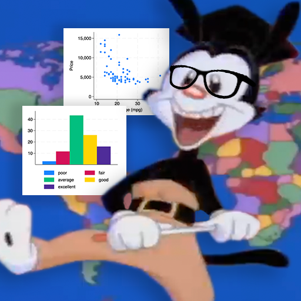

<!-- PROJECT LOGO -->
 

  
  <h1>Yakko's World Data</h1>

**Yakko's World Data** is a video generation tool to programatically create videos overlaying data indicators from the [World Data Bank](https://data.worldbank.org) open collection onto the "Nations of the world" (Yakko's World) segment from the hit 90s cartoon _Animaniacs_.

A curated list of complete videos can be found on the [Yakko's World Data Youtube page](https://www.youtube.com/channel/UCDvc4mKSzbfAZxTG0au4NJw)

## Pipeline

- **R** to collate data sources from the several collections available on the WDB (e.g. Environmental Social and Governance (ESG) collection, Health Nutrition and Population (HNP) collection, etc.).
- **pandas (Python)** to filter data to the specified indicator, normalize data, and calculate timings for each country segment. Generate JSON file containing information for the video generation, generate description, generate audio using the **PyRubberband** library.
- **Remotion (React, Typescript)** to generate the visuals based on the provided input data by modifying the original Yakko's world video to fit the timing data and generating graphical overlays to show the formatted indicator data.
- **FFMPEG** to combine the generated audio and video files.
- **Bash** script to perform everything with one executable.

